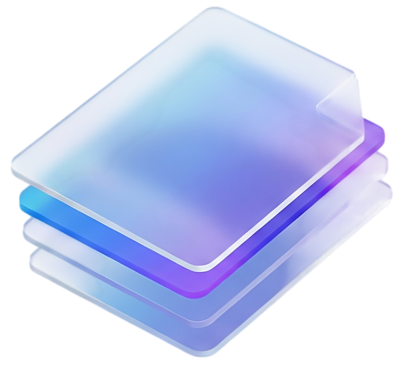

<div align="center">
  
  <br />
</div>

# 🚀 Simpli Framework


> **The Next-Generation Documentation Framework.**
> Built for speed, designed for beauty. Powered by **React 19**, **Vite 7**, and **Tailwind CSS 4**.

Simpli is a lightweight, blazing-fast documentation framework that lets you focus on writing content while we handle the rest. With a zero-config philosophy and a powerful plugin system, it's perfect for personal blogs, technical documentation, and product manuals.

## ✨ Features

- **⚡ Lightning Fast**: Powered by **Vite 7**, featuring instant server start (<100ms) and lightning-fast HMR (<10ms).
- **🎨 Modern Styling**: Built with **Tailwind CSS v4** for a utility-first, fully customizable design system.
- **⚛️ React 19 Core**: Leverage the latest React features, including the new React Compiler for automatic optimization.
- **📝 MDX Powered**: Write content in Markdown mixed with React components. Interactive documentation made easy.
- **🔍 Type-Safe Config**: Full TypeScript support with `defineConfig` for excellent DX and autocomplete.
- **🌍 Advanced Typography**: First-class support for various font families including **Thai fonts** (`Prompt`, `Sarabun`, `Kanit`) and Google Fonts.
- **📱 Mobile First**: Responsive glassmorphism design that looks stunning on any device.
- **🔦 Built-in Search**: Integrated local search or Algolia DocSearch support.
- **🌙 Dark Mode**: Automatic theme switching with system preference respect.

---

## 🚀 Quick Start

### Create a New Site

The easiest way to start is using the scaffold command:

```bash
# Initialize a new project
npm create simpli@latest my-docs

# Navigate to directory
cd my-docs

# Start development server
npm run dev
```

---

## 📁 Project Structure

A typical Simpli project looks like this:

```bash
my-docs/
├── blog/                  # Blog posts (optional)
│   └── welcome.mdx
├── docs/                  # Documentation files
│   ├── intro.mdx
│   └── api/
│       └── reference.mdx
├── src/
│   └── pages/             # Custom React pages
│       └── index.tsx
├── simpli.config.ts       # Main configuration file
├── package.json
└── vite.config.ts
```

---

## ⚙️ Configuration

Simpli is highly configurable via `simpli.config.ts`. Here represents a comprehensive configuration example:

```typescript
import { defineConfig } from 'simpli-framework';

export default defineConfig({
  title: 'Simpli Docs',
  tagline: 'Documentation made simple',
  url: 'https://simpli.js.org',
  baseUrl: '/',
  
  // Custom Font Configuration
  themeConfig: {
    font: {
      // Options: 'inter', 'prompt', 'sarabun', 'kanit', 'noto-sans-thai'
      family: 'prompt', 
      weights: [300, 400, 500, 600, 700],
      thaiOptimized: true,
    },
    
    // Color Mode (Dark/Light)
    colorMode: {
      defaultMode: 'light',
      respectPrefersColorScheme: true,
    },

    // Navigation Bar
    navbar: {
      title: 'Simpli',
      logo: {
        src: '/img/logo.svg',
        alt: 'Simpli Logo',
      },
      items: [
        { label: 'Docs', to: '/docs', position: 'left' },
        { label: 'Blog', to: '/blog', position: 'left' },
        { type: 'search', position: 'right' },
        { type: 'themeToggle', position: 'right' },
      ],
    },

    // Footer
    footer: {
      style: 'dark',
      copyright: `Copyright © ${new Date().getFullYear()} Simpli Framework.`,
      links: [
        {
          title: 'Docs',
          items: [{ label: 'Getting Started', to: '/docs/intro' }],
        },
        {
          title: 'Community',
          items: [{ label: 'GitHub', href: 'https://github.com/simpli' }],
        },
      ],
    },
    
    // Search Configuration
    search: {
      enabled: true,
      provider: 'local', // or 'algolia'
      local: {
        highlightSearchTerms: true,
      },
    },
  },
  
  // Documentation Settings
  markdown: {
    mermaid: true, // Enable Mermaid diagrams
    math: true,    // Enable LaTex math
  },
});
```

---

## 🎨 Customizing Logo & Branding

Simpli makes it easy to add your brand identity. You can configure the logo, favicon, and even provide different logos for light and dark modes.

### 1. Preparing Your Assets

Place your image files in the `public/` folder. This ensures they are accessible from the root URL.

```
my-docs/
├── public/
│   ├── logo.svg        # Main logo
│   ├── logo-dark.svg   # Dark mode logo (optional)
│   └── favicon.ico     # Browser tab icon
```

### 2. Configuring `simpli.config.ts`

Update your configuration file to reference these assets:

```typescript
export default defineConfig({
  // ...
  favicon: '/favicon.ico', // Path relative to public folder

  themeConfig: {
    navbar: {
      title: 'My Project',
      logo: {
        alt: 'My Project Logo',
        src: '/logo.svg',       // Default logo (Light mode)
        srcDark: '/logo-dark.svg', // Optional: Different logo for Dark mode
        width: 32,              // Optional: Force width
        height: 32,             // Optional: Force height
      },
      // ...
    },
    footer: {
      logo: {
        alt: 'Footer Logo',
        src: '/logo.svg',
        width: 100,
      },
      // ...
    },
  },
});
```

---

## 🖼️ Using Images in Content

You can use images in your Markdown/MDX files in two ways:

### Method 1: Absolute Path (Recommended)
Use images stored in the `public/` folder. Reference them starting with `/`.

```markdown

```

### Method 2: Relative Path (Co-location)
Place images directly next to your `.mdx` files. This is great for keeping content organized.

```
docs/
├── intro.mdx
└── assets/
    └── schematic.png
```

In `intro.mdx`:

```markdown

```

### Method 3: Using React Components
Since MDX supports React, you can use standard `` tags for more control (styling, sizing).

```jsx

```

---

## 📝 Writing Content

Simpli fully supports both **Standard Markdown (`.md`)** and **MDX (`.mdx`)**.

- **Markdown (`.md`)**: Use for standard documentation. Simple, clean, and portable.
- **MDX (`.mdx`)**: Use when you need interactivity. Allows you to import and use React components directly within your content.

### Frontmatter

Each `.md` or `.mdx` file can include frontmatter to define metadata:

```mdx
---
title: Getting Started
description: Learn how to install and use Simpli
sidebar_position: 1
tags: [guide, setup]
---

# Getting Started

Welcome to **Simpli**! This is a paragraph in Markdown.

## Using Components

You can import and use React components:

import { Badge } from '../components/Badge';

<Badge color="success">v1.0.0</Badge>

:::tip
This is a built-in admonition component useful for highlighting tips!
:::
```

### 🧩 Built-in Components

Simpli comes with a set of powerful, pre-styled React components that you can use directly in your MDX files.

### 1. Admonitions (Callouts)

Highlight important information with distinct styling.

**Usage:**

```jsx
<Admonition type="note" title="Note">
  This is a general note for the user.
</Admonition>

<Admonition type="tip">
  **Pro Tip:** You can include Markdown _formatting_ in Simpli!
</Admonition>

<Admonition type="warning" title="Watch Out">
  Be careful when modifying configuration files.
</Admonition>
```

**Supported Types:** `note`, `tip`, `info`, `warning`, `danger`, `caution`, `success`, `important`.

### 2. Tabs

Organize content into switchable tabs.

**Usage:**

```jsx
<Tabs defaultValue="npm">
  <TabsList>
    <TabsTrigger value="npm">npm</TabsTrigger>
    <TabsTrigger value="yarn">yarn</TabsTrigger>
    <TabsTrigger value="pnpm">pnpm</TabsTrigger>
  </TabsList>
  <TabsContent value="npm">
    ```bash
    npm install simpli-framework
    ```
  </TabsContent>
  <TabsContent value="yarn">
    ```bash
    yarn add simpli-framework
    ```
  </TabsContent>
  <TabsContent value="pnpm">
    ```bash
    pnpm add simpli-framework
    ```
  </TabsContent>
</Tabs>
```

### 3. Cards

Create grid layouts for navigation or feature highlighting.

**Usage:**

```jsx
<CardGroup cols={2}>
  <Card 
    title="Quick Start" 
    icon={<Rocket />} 
    href="/docs/intro"
    description="Get started with Simpli in under 5 minutes."
  />
  <Card 
    title="Configuration" 
    icon={<Settings />} 
    href="/docs/config"
    description="Learn how to customize your site."
  />
</CardGroup>
```

### 4. Code Blocks

Enhanced code blocks with syntax highlighting, line numbers, and copy button.

**Usage:**

````mdx
```typescript title="simpli.config.ts" showLineNumbers
import { defineConfig } from 'simpli-framework';

export default defineConfig({
  title: 'My Site',
});
```
````

### 5. Details (Collapsible)

Hide complex content behind a toggle.

**Usage:**

```jsx
<details>
  <summary>Click to view advanced options</summary>
  
  Here are some detailed settings that are hidden by default...
</details>
```

---

## 🛠️ CLI Reference

The `simpli` CLI tool helps you manage your project.

| Command | Description | Usage |
|---------|-------------|-------|
| `create` | Scaffolds a new Simpli project | `npx simpli create <name>` |
| `dev` | Starts the development server | `npx simpli dev` |
| `build` | Builds the site for production | `npx simpli build` |
| `serve` | Serves the production build locally | `npx simpli serve` |
| `clear` | Clears local cache and build artifacts | `npx simpli clear` |

---

## 🤝 Contributing

Contributions are welcome! Please read our [Contributing Guide](CONTRIBUTING.md) for details on our code of conduct and the process for submitting pull requests.

## 📄 License

This project is licensed under the MIT License - see the [LICENSE](LICENSE) file for details.

---

<p align="center">
  Built with ❤️ by the Simpli Team
</p>
